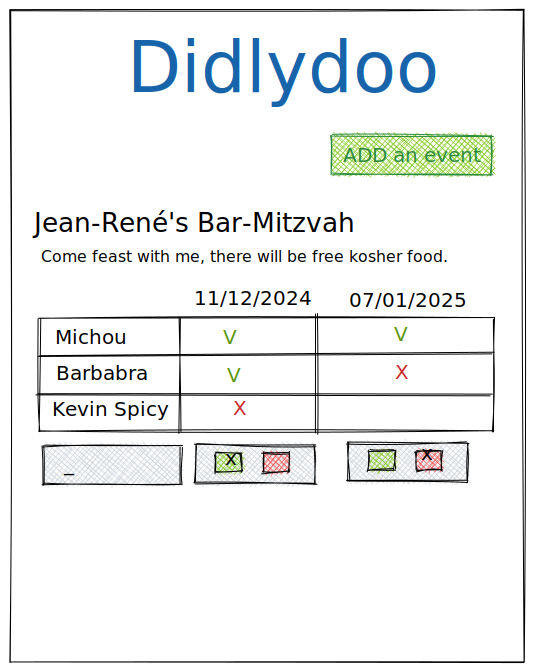

# Didlydoo

> Didlydoo is a revolutionary website that allows you to create events and let anyone add their availability to find the best date for everyone.

## The mission

You have been hired by a "truly disruptive" startup, to create a revolutionnary tool to plan events with friends and relatives. Introducing Didlydoo, the event planner!

A backend developer has already created an API for the tool, so you can focus on the frontend. The list of endpoints is available below.

Your tasks is to :

- 🌱 Display all the events, including everyone's availability
- 🌱 Allow users to create events
- 🌱 Allow users to add their availability to an existing event
- 🌱 Edit an event name/description/author
- 🌱 Delete an event
- 🌼 Display the best possible date according to availabilities
- 🌼 Have a look at the backend code, try to change the message displayed on startup.

This is the mockup that the company founder has drawn on a piece of paper during a lunch break (you can use it, or create your own layout).

## Specific React tools to have

> This about the haves in the React tool-belt.

- 🌱 React Routing system. cf: `'react-router-dom'`
- 🌱 Styled components
- 🌱 Uuid
- 🌼 Framer-motion

## Advices
- Read the backend documentation carefully
- Draw the design, with the different pages, on a piece of paper
- Code the design with fakes datas
- Implement React components (have big components is good for a first draft)
- Identify the states
- Try to get the datas from the backend with `useState()`
- Implement the Router
- Add your logic to manage the states

# Backend setup

Clone the repo on your computer and open in it in a terminal, then type `npm install` once to install the dependencies.

To launch the server simply type `node server/index.mjs` to start the server (the terminal has to remain open and running).

## Endpoint documentation

| Method | Endpoint                   | Body                                                                                          | Response                                                                                                                                  |
| ------ | -------------------------- | --------------------------------------------------------------------------------------------- | ----------------------------------------------------------------------------------------------------------------------------------------- |
| GET    | /api/events/               |                                                                                               | A list of all the events                                                                                                                  |
| GET    | /api/events/[id]           |                                                                                               | A single event                                                                                                                            |
| GET    | /api/attendees/            |                                                                                               | Get a list of all the attendees, and the events they're attending                                                                         |
| GET    | /api/attendees/[name]      |                                                                                               | Get all attendances for a given name                                                                                                      |
| POST   | /api/events/               | `{ name: string, dates: array of dates ['YYYY-MM-DD'], author: string, description: string }` | Creates an event with `dates` as possibilities. You must provide an author, a name and a description for the event                        |
| PATCH  | /api/events/[id]/          | `{ name: string (optional), author: string (optional), description: string (optional) }`      | Patches (edit) an event with the provided infos                                                                                           |
| DELETE | /api/events/[id]/          |                                                                                               | Deletes an event                                                                                                                          |
| POST   | /api/events/[id]/add_dates | `{ dates: array of dates ['YYYY-MM-DD'] }`                                                    | Add some possible dates to an event                                                                                                       |
| POST   | /api/events/[id]/attend    | `{ name: string, dates : [ { date: date 'YYYY-MM-DD', available: boolean (true/false) } ] }`  | Add an attendance for the given event. You must provide the attendee's `name` and some availabilities, in the form of an array of object  |
| PATCH  | /api/events/[id]/attend    | `{ name: string, dates : [ { date: date 'YYYY-MM-DD', available: boolean (true/false) } ] }`  | Edit an attendance for the given event. You must provide the attendee's `name` and some availabilities, in the form of an array of object |

# Frontend set up

For the frontend, create a directory `client` and set it up your application. 
